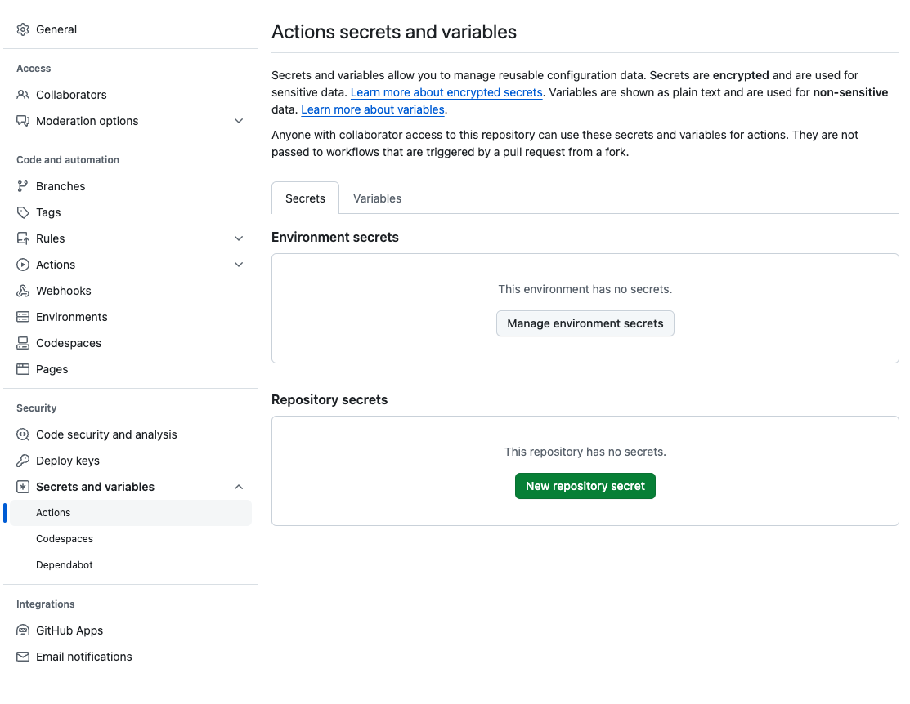
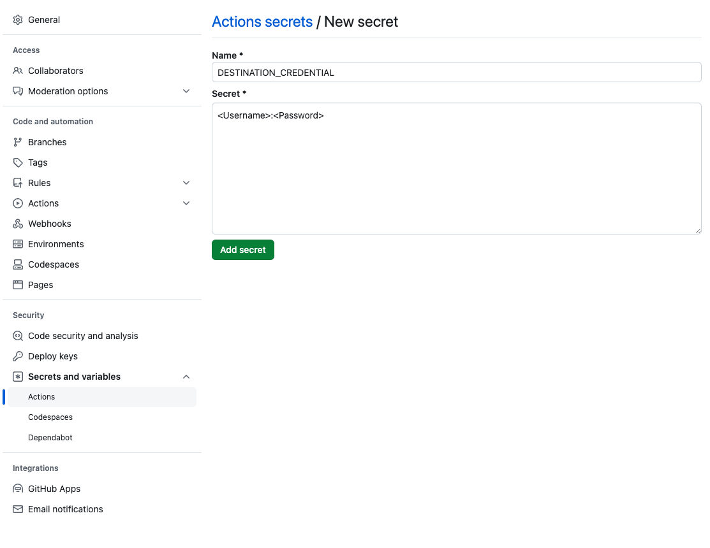
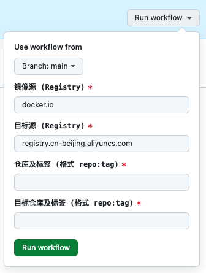
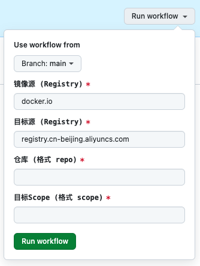

## 同步DockerHub上的镜像仓库到阿里云容器镜像仓库

Docker 的一些服务所在域名被封杀，无法直接访问和拉取镜像。国内的镜像源又宣布停止服务，所以需要一个工具将DockerHub上的镜像同步到阿里云容器镜像仓库。

阿里云容器镜像仓库提供了个人实例服务，支持最多创建300个仓库，而且免费。个人使用完全够满足需求。

阿里云容器镜像仓库地址： [https://cr.console.aliyun.com/](https://cr.console.aliyun.com/)

支持用命令行触发workflow运行，[点此查看方法](#使用命令行直接同步镜像)

## Copy.yml 运行介绍

这个工具主要是将 DockerHub 上某个仓库下的某个标签同步到阿里云容器镜像仓库。

1. 使用阿里云开通个人实例服务，并获取 [登录用户名和固定密码](https://cr.console.aliyun.com/cn-hangzhou/instance/credentials)

2. 克隆本仓库，在仓库设置中配置阿里云密码，注意 *Name* 必须为 `DESTINATION_CREDENTIAL` 且内容格式必须为 `<Username>:<Password>` 即用户名和密码之间用冒号分隔。





3. 在 *Actions* 页面上选择 *copy.yml* 点击 *Run workflow* 填写内容即可运行。



> 填写说明：
>
> 如同步 DockerHub 上的 nginx:1.13 到 阿里云容器镜像仓库 registry.cn-beijing.aliyuncs.com/ikrong/nginx:1.13，则填写如下：
>
> ```yaml
> # 镜像源 (Registry)
> source: docker.io
> # 目标源 (Registry)
> destination: registry.cn-beijing.aliyuncs.com
> # 仓库及标签 (格式 repo:tag)
> source_repo: nginx:1.13
> # 目标仓库及标签 (格式 repo:tag)
> destination_repo: ikrong/nginx:1.13
> ```
> 必须要填写仓库及标签

## Sync.yml 运行介绍

这个工具主要是将 DockerHub 上某个仓库下的所有标签全部同步到阿里云容器镜像仓库。

1. 配置密码同上

2. 在 *Actions* 页面上选择 *sync.yml* 点击 *Run workflow* 填写内容即可运行。



> 填写说明：
>
> 如同步 DockerHub 上的 nginx 的所有标签到阿里云容器镜像仓库 registry.cn-beijing.aliyuncs.com/ikrong/nginx，则填写如下：
>
> ```yaml
> # 镜像源 (Registry)
> source: docker.io
> # 目标源 (Registry)
> destination: registry.cn-beijing.aliyuncs.com
> # 仓库 (格式 repo)
> source_repo: nginx
> # 目标Scope (格式 scope)
> destination_scope: ikrong
> ```
> 只需要填写需要同步的仓库和目标仓库所在的scope


## 使用命令行直接同步镜像

现在提供脚本 ```exec.sh``` 可以在linux或者macos上运行，下面介绍运行方法：

1. 命令行上基于 [github-cli](https://github.com/cli/cli) 实现的，所以需要先安装 github-cli 工具

```shell
# 快速安装方法
curl -sS https://webi.sh/gh | sh
# 或者可以查看 github-cli 文档自己下载安装
# https://github.com/cli/cli?#installation
```

2. 安装 github-cli 后需要登陆

```shell
# 登陆命令
gh auth login
```

3. fork本仓库，并且按照 [上面copy.yml中密码相关配置](#copyyml-运行介绍) 进行配置

4. 使用git clone你fork后的仓库，然后开始执行根目录下的 exec.sh 文件，注意文件的执行权限

5. 命令行运行 copy.yml workflow

以将 nginx:1.13 复制到 registry.cn-beijing.aliyuncs.com/ikrong/nginx:1.13 仓库为例

```shell
# 命令行如下：
./exec.sh trigger -w copy.yml destination=registry.cn-beijing.aliyuncs.com source_repo=nginx:1.13 destination_repo=ikrong/nginx:1.13
# 可以省略等号前面的，但是顺序不能变
./exec.sh trigger -w copy.yml registry.cn-beijing.aliyuncs.com nginx:1.13 ikrong/nginx:1.13
# 由于脚本默认 registry.cn-beijing.aliyuncs.com ，所以这个也可以省略
./exec.sh trigger -w copy.yml nginx:1.13 ikrong/nginx:1.13
# 另外 trigger -w copy.yml 可以简写为 copy，所以命令可以改为
./exec.sh copy nginx:1.13 ikrong/nginx:1.13

# 查看运行状态，不过上面的 trigger 命令执行时会自动输出 status，下面的命令一般不需要执行
./exec.sh status -w copy.yml
```

6. 命令行运行 sync.yml workflow

以将 nginx 同步到 registry.cn-beijing.aliyuncs.com/ikrong/nginx 仓库为例

```shell
# 命令行如下
./exec.sh trigger -w sync.yml destination=registry.cn-beijing.aliyuncs.com source_repo=nginx destination_scope=ikrong
# 仍然可以省略等号前面的
./exec.sh trigger -w sync.yml nginx ikrong
# 另外 trigger -w sync.yml 可以简写为 sync，所以命令可以改为
./exec.sh sync nginx ikrong
```

7. 推荐使用命令

```shell
# 如果想要复制1个标签，如 nginx:1.13 到 registry.cn-beijing.aliyuncs.com/ikrong/nginx:1.13
# 则可以使用命令
./exec.sh copy nginx:1.13 ikrong/nginx:1.13

# 如果想要同步某个仓库，如 nginx 到 registry.cn-beijing.aliyuncs.com/ikrong/nginx 仓库
# 则可以使用命令
./exec.sh sync nginx ikrong
```

8. 为了减少记忆负担，再次简化 copy 和 sync 命令

执行 copy 和 sync 命令时，可以将 registry/scope/repo:tag 写在一起，更符合常见的用法

不过，由于 sync 命令特殊，源仓库的 tag 和目标仓库的 repo:tag 将会被忽略掉

同时，增加 ./copy.sh 和 ./sync.sh 两个脚本，内部调用 ./exec.sh

```shell
# 想要复制某个镜像标签，可以直接这样执行命令
./exec.sh copy ghcr.io/nginx:1.13 registry.cn-hangzhou.aliyuncs.com/ikrong/nginx:1.13
./exec.sh copy nginx:1.13 registry.cn-hangzhou.aliyuncs.com/ikrong/nginx:1.13
# 想要同步某个仓库，可以直接这样执行命令
./exec.sh sync ghcr.io/nginx registry.cn-hangzhou.aliyuncs.com/ikrong
./exec.sh sync ghcr.io/nginx:1.13 registry.cn-hangzhou.aliyuncs.com/ikrong/nginx:1.13 
# 指定标签和上面不指定标签无任何区别，脚本会忽略掉后面的标签

# 使用 ./copy.sh 和 ./sync.sh 命令
./copy.sh ghcr.io/nginx:1.13 registry.cn-hangzhou.aliyuncs.com/ikrong/nginx:1.13
./sync.sh nginx registry.cn-hangzhou.aliyuncs.com/ikrong
```

9. 当使用copy时，可以指定参数 --pull 就可以在 workflow 执行完毕后，自动拉取镜像

```shell
./copy.sh nginx:1.14 ikrong/nginx:1.14 --pull
```

10. 脚本默认会有确认提示，使用参数 -y 可以跳过确认执行

```shell
./copy.sh nginx:1.14 ikrong/nginx:1.14 -y
./sync.sh nginx ikrong -y
```

## 镜像同步之后如何使用

当使用上面办法将镜像同步到阿里云容器镜像仓库后，就可以直接使用阿里云容器镜像仓库的镜像了。

以 `nginx:1.13` 为例:

1. 使用命令拉取 

```sh
docker pull registry.cn-beijing.aliyuncs.com/ikrong/nginx:1.13
```

2. 在 `Dockerfile` 中使用：

```dockerfile
FROM registry.cn-beijing.aliyuncs.com/ikrong/nginx:1.13

# 其他内容
```
